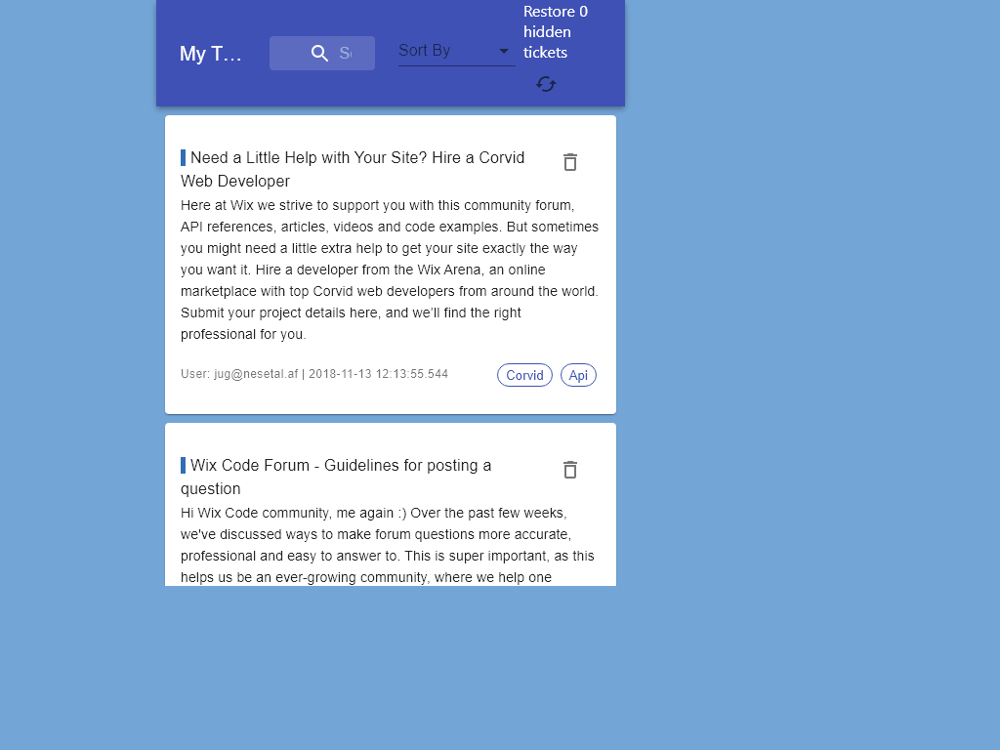

#    Final 1 - Ticket Manager
This project includes an app that know to manage tickets that come from a server.

## Check My App On Glitch!
https://glitch.com/~tomertv2-ticket-manager-glitch-2

## Backend Features:
  - [GET] api/tickets - You can get all the tickets from saved. If you call with `query param` - `api/tickets?searchText=partOfATitle` you will get all the tickets that includes the `query param` in their title.
  - [POST] api/tickets/`:ticketId`/done - You can set `done` property to `true` for the given ticketId.
  - [POST] api/tickets/`:ticketId`/undone - You can set `done` property to `false` for the given ticketId.

## Client Features
- The app load data from server and show all tickets.
- The app have search text field that find all the tickets that include the text value on every change.
- Every ticket has a hide button that will hide the tickets from view. you can see how many tickets are hidden on top.
- You can restore all hidden tickets with simple click on the restore button.

## Bonus
- You can sort all the tickets that displayed on screen with the sort select menu. Change it as you wish.
